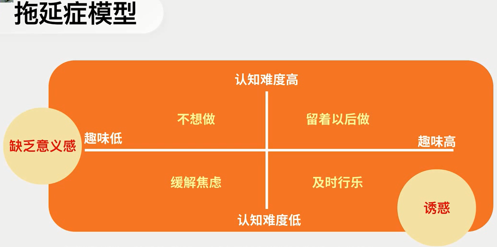

  

认知难度=认知复杂度 * 期望值 / 自我能力评估（自信）

拖延类型1：结果焦虑型

- 担心结果不好
- 担心他人、自我评价
- 灾难性思维：花大量时间思考结果
- 反刍性思维：入睡困难
- 情绪消耗严重

焦虑型的心理及脑机制

- 表现焦虑
- 感受到威胁
- 焦虑-恐惧：杏仁核
- 战斗或逃跑反应

拖延类型2：完美主义型的表现

- 花大量的时间做准备工作，迟迟无法开始
- 工作完成后花大量的时间检查错误，企图修正，以至于超过提交期限
- 极度在意他人的评价，他人的负面评价听起来是对我的全盘否定
- 只喜欢做自己擅长的事情
- 明明做了很多工作，但依然觉得自己做得不够
- 心目中总有假想敌，觉得别人可以做得好，我也应该那么好
- 觉得我曾经很高效过，所以应该一直保持这种高效

完美主义型的心理及脑机制

- 适应良好的完美主义者vs适应不良的完美主义者
- 将表现结果等同于自我评价（人格泛化）
- 非黑即白的思维模式
- 预期过高（和完美自我比较，和完美他人比较，和完美目标比较）
