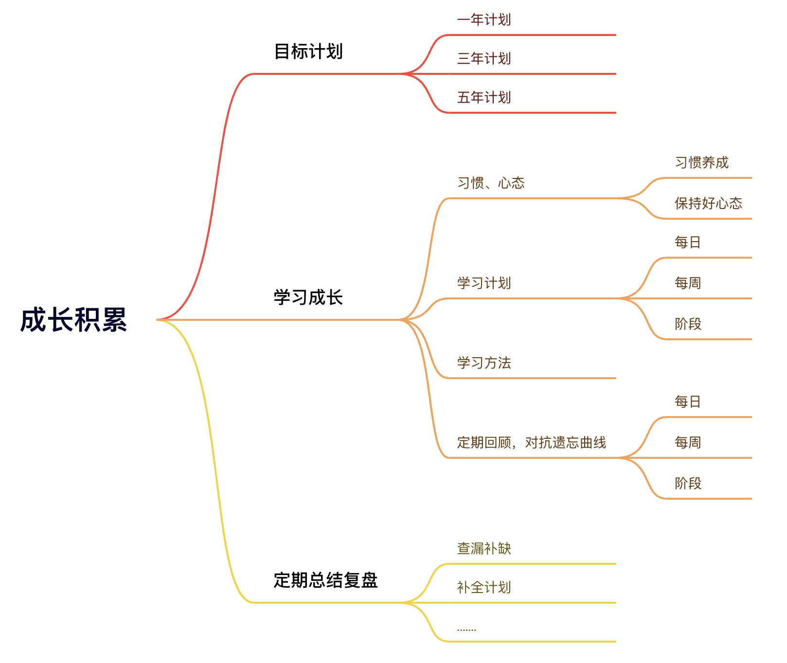
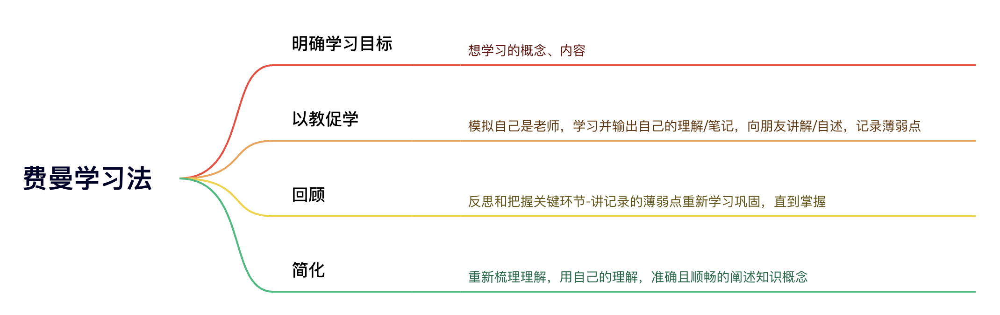
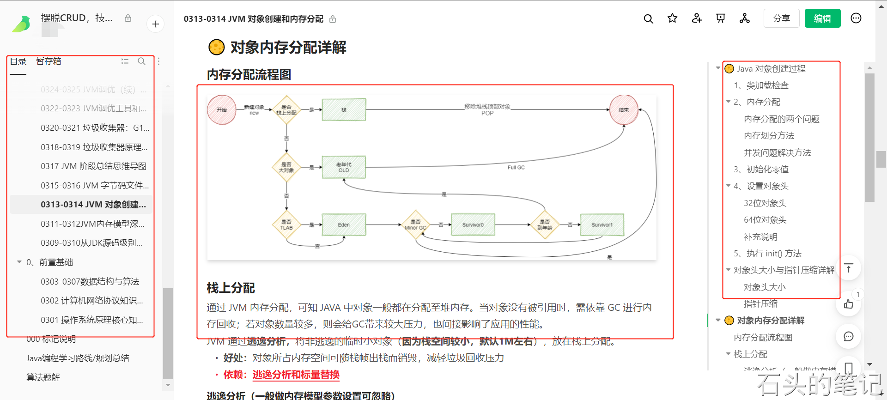

### 目标计划：树目标定战略，做中短期、长期成长的规划

确定自己的目标，需要成为什么样的人

> - 没有速成班
> - 放弃速成心态，静心认真学习
> - 成长积累，逐步改变

建立成长规划/战略，提高思考力

- 架构
  - 技术架构
  - 业务架构
- 管理
- 产品
- ......

制定计划，并坚持

> 制定目标/计划：三段分解
>
> - 分阶段：当前状态与最终目标状态间，分解出中间等级
> - 分能力：分解出对下一个目标需要的能力目标，专项学习提升
> - 分行动：准对上面的目标，制定出具体（行动）计划，执行

  

- 目标会引导自己做内心一直渴望去做的事，如果连自己想做的事情都做不好，又怎么做好必须要做但又不想做的事情？
- 结合自己实际情况，给自己定目标-1年内/3年内/5年内，平台/晋升/加薪/摆脱平台限制/个人IP

### 学习工作：学习和工作做事方法

#### 学习（技术）

- 找准自己目标之后，掌握合理学习方法，定制自己专属学习计划，持续学习
- 经过自己提炼简化之后掌握的知识，阶段性结合牛客网题库检验加深记忆

学习/巩固-费曼学习

  

- 笔记整理

  - 文档输出

     

  - 流程图

  - 思维导图

  - 视频录制/讲演分享

整理来源：[图灵学员优秀学员分享](https://www.yuque.com/yifeng-fihfy/hq0ova/flly7uiek06bq72o)